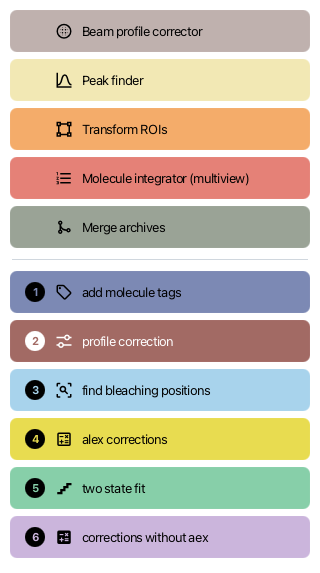
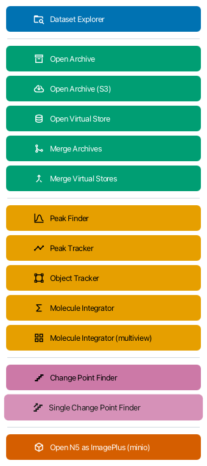
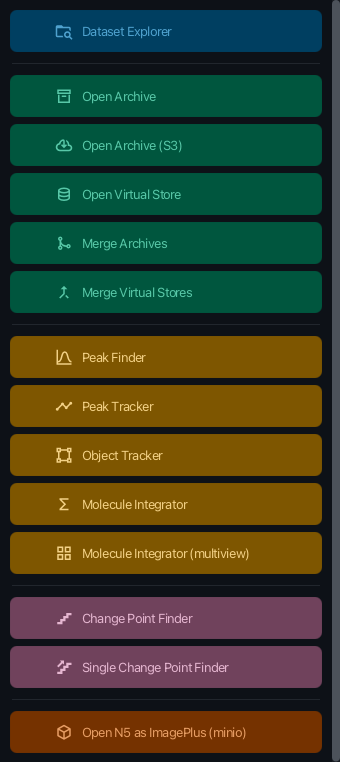

[](https://github.com/duderstadt-lab/action-bar-fx/actions/workflows/build-main.yml)

# action-bar-fx

Custom button palettes for Fiji. A bar is a column of colored buttons, each one
launching an ImageJ command, a script, or an IJ1 macro — the tools of one
workflow gathered in a single window instead of scattered across the menus.

 

A replacement for the legacy ImageJ ActionBar plugin, built on JavaFX and
AtlantaFX.

## Why

A workflow that takes eleven commands takes eleven trips into the menus, and the
order matters. A bar puts them in front of you in the right order, colored so
you can find one by eye and numbered when the sequence is part of the protocol.

The two bars above show the difference in intent. **FRET power tools** is a
protocol: five setup commands, then six numbered steps to work through.
**Mars power tools** is a toolbox: fourteen commands reached for in any order,
colored by category with nothing to number. Both ship in
[ActionBar/](ActionBar).

## Install

Copy `target/action-bar-fx-*.jar` into `Fiji.app/jars/` and restart. Both
example bars ship inside the jar and are written into `Fiji.app/ActionBar/` on
first start, so they appear in the menu straight away — neither is opened until
you ask for it. They need
[Mars](https://duderstadt-lab.github.io/mars-docs/) installed for their command
buttons.

Each is installed once and then left alone: an edited bar is never overwritten,
and a deleted one does not come back. Your own bars go in the same folder.

Hyphens, case and the plural do not matter in the folder name — `ActionBar`,
`action-bars` and `Action Bars` are all scanned — because getting it slightly
wrong should not leave a bar silently missing. The scan is logged at startup, so
the ImageJ console says which folder was read and how many bars it held.

## Using a bar

Each discovered bar appears under **Plugins › Action Bar FX › \<title\>**, listed
above the commands:

- **Open bar…** — open any bar folder
- **New bar…** — create one and open the builder
- **Edit bar…** — open the builder on an existing bar
- **Rescan action bars** — pick up a folder dropped in after Fiji started

**Right-click a bar** for **Dark theme**, **Palette**, **Edit bar…**,
**Reload**, **Open when Fiji starts** and **Close bar**.

Clicking a button runs the command exactly as the menu would, parameter dialog
and all. The button disables itself and shows a spinner until the command
finishes, so a slow step looks busy rather than ignored. If it fails, the bar
says so itself — a toast and a red outline on the button — rather than only
writing to the console.

The theme is remembered between sessions and applies to every open bar. Because
a button stores one base color and every state derives from it, the same bar
reads correctly in both:

 

## Making a bar

**Plugins › Action Bar FX › New bar…** asks for a title and a folder, then opens
the builder: rows on the left, the editor in the middle, a live preview of the
bar on the right.

Each button has a label, an optional step badge, a color, an icon and an action.
The action is one of three:

- **command** — anything in Fiji's menus. *Choose command…* browses the whole
  menu tree with a filter that flattens to matching entries as you type.
- **script** — a script file. One picked from elsewhere is copied into the bar's
  `scripts/` folder, so the bar stays self-contained.
- **ij1** — a raw IJ1 macro string, mainly so macros from the legacy ActionBar
  port over by copy-paste.

Icons are [Ikonli](https://kordamp.org/ikonli/) Material Design 2 literals. The
picker shows all ~7,500 as a grid with a search box and category tabs; names
appear on hover and for the current selection, and a double-click picks one.

## Bar format

A bar is a self-contained directory, so it can be zipped and shared:

```
fret-power-tools/
  bar.json
  scripts/
    FRET_workflow_1_add_molecule_tags.groovy
  icons/          (optional, for custom icons)
```

```json
{
  "formatVersion": 1,
  "title": "FRET power tools",
  "palette": "legacy-pastel",
  "width": 320,
  "items": [
    {
      "type": "button",
      "label": "Peak finder",
      "paletteIndex": 1,
      "icon": "mdi2c-chart-bell-curve",
      "action": {
        "type": "command",
        "class": "de.mpg.biochem.mars.image.commands.PeakFinderCommand",
        "menuPath": "Plugins>Mars>Image>Peak Finder"
      }
    },
    { "type": "separator" },
    {
      "type": "button",
      "label": "add molecule tags",
      "step": 1,
      "paletteIndex": 5,
      "action": { "type": "script", "path": "scripts/FRET_workflow_1_add_molecule_tags.groovy" }
    },
    {
      "type": "button",
      "label": "Close log",
      "action": { "type": "ij1", "macro": "if (isOpen(\"Log\")) { selectWindow(\"Log\"); run(\"Close\"); }" }
    }
  ]
}
```

Rules:

- `paletteIndex` is the source of truth for color; `color` is an optional hex
  override. Switching the bar palette recolors everything without an override.
- `action.path` is relative to the bar folder, which is what keeps the folder
  portable.
- `action.class` is resolved first; `menuPath` is a fallback and a
  human-readable hint. Menu paths get reorganized between releases; class names
  do not.
- `step` renders the numbered badge. Buttons without one still reserve the badge
  slot, so labels line up across the bar.
- Fields this build does not recognize are preserved on save, so a bar written
  by a newer version is not stripped when an older one re-saves it.

### Palettes

A palette is a ready-made set of colors, chosen once for the whole bar. A button
does not store a color of its own — it points at an entry in the palette. That
is what lets you switch the bar to a different palette and have every button
recolor coherently instead of one at a time.

Six are shipped, in
[palettes.json](src/main/resources/de/tum/nat/sdmm/actionbarfx/palettes.json):

| id | what it is |
|---|---|
| `okabe-ito` | 8 colors, the default. The [Okabe–Ito set](https://jfly.uni-koeln.de/color/), designed to stay distinguishable for the common forms of color blindness — the reason it is the default |
| `tol-bright` | 7 colors, Paul Tol's bright set, also color-blind safe |
| `tableau` | Tableau 10. Familiar, but not fully color-blind safe |
| `tol-muted` | 10 muted colors |
| `tol-extended` | 15 colors. Past about 12, lean on step badges and separators too |
| `legacy-pastel` | 11 colors matching the original FRET Power Tools bar |

In the builder, the bar's palette is the dropdown at the top; the button's color
is the row of swatches under **Color** — click one to assign it. The last swatch
(`—`) means "no palette color", which draws a neutral gray. **Override with a
custom color** is the escape hatch for a one-off hue that should survive a
palette switch.

Buttons that belong together can share one palette entry. That is what makes the
Mars bar read as four groups rather than fourteen unrelated buttons, and it
survives a palette switch.

## Scripting

The service is registered as a script alias, so a Groovy script can open or
reload a bar:

```groovy
#@ ActionBarService actionBars

actionBars.open(new File("/path/to/fret-power-tools"))
actionBars.reload(new File("/path/to/fret-power-tools"))
```

## Building

```bash
mvn clean package
```

Java 21 and JavaFX 23, matching what Fiji ships.

To work on the look of a bar without starting Fiji, there is a standalone
preview with live stylesheet reload through CSSFX:

```bash
mvn -q test-compile exec:java -Dexec.classpathScope=test -Dexec.mainClass=de.tum.nat.sdmm.actionbarfx.ui.ActionBarPreview -Dexec.args=ActionBar/fret-power-tools
```

## How it works

```
de.tum.nat.sdmm.actionbarfx
  ActionBarService            interface, extends net.imagej.ImageJService
  DefaultActionBarService     @Plugin(type = Service.class)
  model/        BarConfig, BarItem, ButtonSpec, SeparatorSpec, ActionSpec,
                Palette, PaletteRegistry
  io/           BarIO (Jackson load/save), BarLocator (finds the scan folders),
                BundledBars (unpacks the shipped bars on first start)
  run/          ActionRunner (command | script | ij1 -> ModuleInfo -> run)
  ui/           ActionBarWindow, ActionBarPane, ActionButton, HoverEffect,
                ThemeManager, Toast, FxBootstrap
  ui.builder/   BarBuilderDialog, CommandPickerPane, IconPickerPane,
                ButtonEditorPane
  commands/     OpenActionBarCommand, NewActionBarCommand, EditActionBarCommand,
                RescanActionBarsCommand
  legacy/       IJ1MenuBridge (lists the bars in Fiji's own menu bar)
```

**One path for every action.** Everything in Fiji's menus — IJ1 legacy commands,
ImageJ2 commands and script files alike — is registered as a `ModuleInfo`, so
all three run through `moduleService.run(info, true)`, which is what makes the
normal parameter dialog appear. Raw IJ1 macro strings are the exception.

**JavaFX starts lazily**, on the first bar opened, never during service
initialization: starting it at startup would cost every user the toolkit whether
or not they ever open a bar, and would break headless runs. For the same reason
`initialize()` resolves no commands — the IJ1 legacy layer may not have
registered them yet — and never throws, so a malformed `bar.json` is a logged
warning rather than a Fiji that will not start.

**Bars are registered twice**, because Fiji has two menus. A `CommandInfo` per
bar goes to the `ModuleService`, which covers the ImageJ2 UI and the search bar.
That is not enough for the menu bar Fiji actually shows: imagej-legacy builds
the IJ1 menu once at startup from `commandService.getCommandsOfType(...)`, the
annotated commands in the plugin index, so modules added at runtime never appear
there however early they are registered. `IJ1MenuBridge` therefore adds the bars
to `Plugins › Action Bar FX` as AWT menu items directly, tagged so a later
rebuild replaces exactly those and leaves the commands alone.

**Styling stays inside our own windows.** The AtlantaFX base theme goes on each
bar scene with `Scene.setUserAgentStylesheet`, never
`Application.setUserAgentStylesheet` — the latter is global to the JVM and
replaces Modena for every JavaFX window in the process, breaking any stylesheet
written against it. In the other direction, a bar puts its own stylesheets back
if another plugin clears them. Fiji is one JVM shared with other people's
windows, and both halves are needed to be a good guest in it.

## License

BSD 2-Clause. See [LICENSE.txt](LICENSE.txt).
