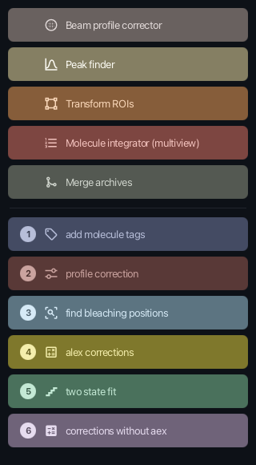

[](https://github.com/duderstadt-lab/ActionBarFX/actions/workflows/build-main.yml)

# ActionBarFX

A Fiji plugin that renders a vertical bar of colored buttons, each launching an
ImageJ command or a script. JavaFX + AtlantaFX. Replaces the legacy ImageJ
ActionBar plugin.

 

## Using a bar

Drop a bar folder into `Fiji.app/action-bars/` and it appears under
**Plugins › Action Bars › \<title\>**. (`ActionBars/` is accepted as well — it is
the obvious thing to type, and a bar in a folder that is nearly right should not
silently fail to show up.) Bars are also opened explicitly:

- **Plugins › Action Bar FX › Open bar…** — pick any bar folder
- **Plugins › Action Bar FX › New bar…** — create one and open the builder
- **Plugins › Action Bar FX › Rescan action bars** — pick up a folder that was
  dropped in after Fiji started

Right-clicking a bar opens its menu: switch theme, switch palette, edit the bar,
reload it from disk, or mark it to reopen when Fiji starts.

The shipped example is `action-bars/fret-power-tools`, the FRET Power Tools bar
from the [Mars docs](https://duderstadt-lab.github.io/mars-docs/tutorials/fretActionBar/)
ported over. Copy that folder into `Fiji.app/action-bars/` to try it. It needs
Mars installed for the five command buttons.

## Bar format

A bar is a self-contained directory, so it can be zipped and shared:

```
fret-power-tools/
  bar.json
  scripts/
    FRET_workflow_1_add_molecule_tags.groovy
  icons/          (optional, for custom icons)
```

```json
{
  "formatVersion": 1,
  "title": "FRET power tools",
  "palette": "legacy-pastel",
  "width": 320,
  "items": [
    {
      "type": "button",
      "label": "Peak finder",
      "paletteIndex": 1,
      "icon": "mdi2c-chart-bell-curve",
      "action": {
        "type": "command",
        "class": "de.mpg.biochem.mars.image.commands.PeakFinderCommand",
        "menuPath": "Plugins>Mars>Image>Peak Finder"
      }
    },
    { "type": "separator" },
    {
      "type": "button",
      "label": "add molecule tags",
      "step": 1,
      "paletteIndex": 5,
      "action": { "type": "script", "path": "scripts/FRET_workflow_1_add_molecule_tags.groovy" }
    },
    {
      "type": "button",
      "label": "Close log",
      "action": { "type": "ij1", "macro": "if (isOpen(\"Log\")) { selectWindow(\"Log\"); run(\"Close\"); }" }
    }
  ]
}
```

Rules:

- `paletteIndex` is the source of truth for color; `color` is an optional hex
  override. Switching the bar palette recolors everything without an override.
- `action.path` is relative to the bar folder, which is what keeps the folder
  portable. The builder copies a script picked from elsewhere into `scripts/`.
- `action.class` is resolved first; `menuPath` is a fallback and a
  human-readable hint. Menu paths get reorganized between releases; class names
  do not.
- `step` renders the numbered badge. Buttons without one still reserve the badge
  slot, so labels line up across the bar.
- Fields this build does not recognize are preserved on save, so a bar written
  by a newer version is not stripped when an older one re-saves it.

Icons are [Ikonli](https://kordamp.org/ikonli/) Material Design 2 literals
(`mdi2t-tag-outline`). The builder has a searchable picker.

### Palettes

Defined in [palettes.json](src/main/resources/de/tum/nat/sdmm/actionbarfx/palettes.json):
`okabe-ito` (default, colorblind-safe), `tol-bright`, `tableau`, `tol-muted`,
`tol-extended`, `legacy-pastel` (matches the original FRET bar).

Each button stores one base color. Every visual state derives from it in CSS, so
one hue works in both themes: `ladder()` picks the text color in light mode, and
dark mode darkens the same hue rather than remapping it — the color coding is
the identity of a button.

## Scripting

The service is registered as a script alias:

```groovy
#@ ActionBarService actionBars

actionBars.open(new File("/path/to/fret-power-tools"))
actionBars.reload(new File("/path/to/fret-power-tools"))
```

## Building

```bash
mvn clean package
```

Java 21, JavaFX 23 (what Fiji ships). Copy `target/actionbar-fx-*.jar` into
`Fiji.app/jars/`.

To work on the look of a bar without starting Fiji, there is a standalone
preview with live stylesheet reload through CSSFX:

```bash
mvn -q test-compile exec:java -Dexec.classpathScope=test -Dexec.mainClass=de.tum.nat.sdmm.actionbarfx.ui.ActionBarPreview -Dexec.args=action-bars/fret-power-tools
```

## Layout

```
de.tum.nat.sdmm.actionbarfx
  ActionBarService            interface, extends net.imagej.ImageJService
  DefaultActionBarService     @Plugin(type = Service.class)
  model/        BarConfig, BarItem, ButtonSpec, SeparatorSpec, ActionSpec,
                Palette, PaletteRegistry
  io/           BarIO (Jackson load/save), BarLocator (scan action-bars dir)
  run/          ActionRunner (command | script | ij1 -> ModuleInfo -> run)
  ui/           ActionBarWindow, ActionBarPane, ActionButton, HoverEffect,
                ThemeManager, Toast, FxBootstrap
  ui.builder/   BarBuilderDialog, CommandPickerPane, IconPickerPane,
                ButtonEditorPane
  commands/     OpenActionBarCommand, NewActionBarCommand,
                RescanActionBarsCommand
```

Everything in Fiji's menus — IJ1 legacy commands, ImageJ2 commands and script
files — is a `ModuleInfo`, so one code path runs all of them through
`moduleService.run(info, true)`, which means the normal parameter dialog
appears. Raw IJ1 macro strings are the exception, and exist mainly so macros
from the legacy ActionBar port over by copy-paste.

The JavaFX toolkit is started lazily on the first bar that is opened, never
during service initialization: that would cost every user the FX startup whether
or not they open a bar, and would break headless runs.

## License

BSD 2-Clause. See [LICENSE.txt](LICENSE.txt).
